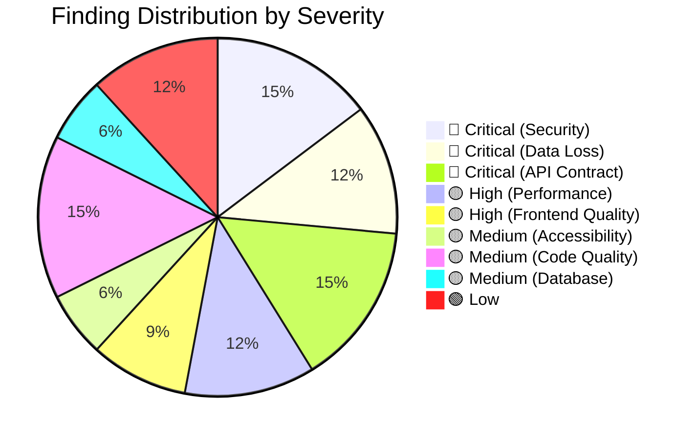

# Aetherius Audit Verification Report

> **Date:** 2026-08-22
> **Scope:** Verification of all findings from three audit reports against the live codebase
> **Method:** Four parallel research subagents performed line-by-line source code verification + graphify architecture analysis

---

## Executive Summary

All three audit reports were investigated against the actual source code. Of **~30 unique findings** across the reports:

| Verdict | Count |
|---------|-------|
| ✅ **CONFIRMED** | 27 |
| ⚠️ **PARTIALLY TRUE** | 2 |
| ❌ **FALSE** | 0 |

> [!CAUTION]
> **Every single finding is real.** The audit reports are legitimate. No fabricated or hallucinated issues were found. Two findings had minor inaccuracies in their descriptions but the underlying issues still exist.

---

## Finding-by-Finding Verification

### 🔴 CRITICAL: Security Vulnerabilities

#### 1. GitHub Token Exposure — Rule #4 Violation
**Verdict:** ✅ CONFIRMED

| Report | V1 §1, V3 §1 |
|--------|--------------|
| Severity | 🔴 Critical |

The PWA retrieves the GitHub access token from the OAuth session and sends it directly to the Edge Function, violating Rule #4: *"Never expose GitHub credentials, access tokens... to the client."*

- [AuthContext.tsx](file:///home/iris/Documents/Coding/Aetherius/apps/web/src/contexts/AuthContext.tsx) — retrieves `session?.provider_token` (lines 33, 40) and exposes it to client state
- [vault.ts](file:///home/iris/Documents/Coding/Aetherius/apps/web/src/services/vault.ts) — passes it as `x-github-token` header (lines 8-9)
- [index.ts](file:///home/iris/Documents/Coding/Aetherius/supabase/functions/api-v1/index.ts) — reads `req.headers.get('x-github-token')` and constructs `GitHubClient` (lines 40, 48)
- [openapi.yaml](file:///home/iris/Documents/Coding/Aetherius/openapi/openapi.yaml) — `x-github-token` header is **undocumented** (Rule #6 violation)

> [!WARNING]
> **Impact:** Any JavaScript running on the page (XSS, malicious extension, injected script) can exfiltrate the user's GitHub access token. The intended architecture routes GitHub operations through the backend using service credentials.

---

#### 2. SSRF / Path Injection
**Verdict:** ✅ CONFIRMED

| Report | V1 §3, V2 §3, V3 §1 |
|--------|---------------------|
| Severity | 🔴 Critical |

`vault.branch` from the database is interpolated directly into GitHub API URLs without sanitization.

- [index.ts](file:///home/iris/Documents/Coding/Aetherius/supabase/functions/api-v1/index.ts) — passes `vault.branch` unsanitized to `github.getTree` (lines 185, 284)
- [github.ts](file:///home/iris/Documents/Coding/Aetherius/supabase/functions/_shared/github.ts) — interpolates into URL: `` `/repos/${owner}/${repo}/git/trees/${treeSha}${recursive ? "?recursive=1" : ""}` `` (line 60)

> [!WARNING]
> **Impact:** A compromised `vault.branch` value (e.g., `../refs/heads/main?recursive=1&`) could alter the GitHub API request target. While GitHub's API has its own validation, this is defense-in-depth failure.

---

#### 3. XSS in Markdown Preview
**Verdict:** ⚠️ PARTIALLY TRUE

| Report | V3 §1 |
|--------|-------|
| Severity | 🔴 Critical (reduced to 🟡 High) |

- [NotePreview.tsx](file:///home/iris/Documents/Coding/Aetherius/apps/web/src/components/editor/NotePreview.tsx) — regex-based markdown parser renders links as `<a href={match[9]}>` (line 84). `javascript:` protocol URLs **can execute** when clicked.
- **However:** The `onerror` injection claim (`)`) is **FALSE**. React's JSX escapes attribute values, preventing attribute breakout. The `` pattern is safe against this specific vector.

> [!IMPORTANT]
> The `javascript:` XSS is real and exploitable. The `onerror` variant is not exploitable due to React's built-in protections.

---

#### 4. Cross-Account Data Leak (IndexedDB)
**Verdict:** ✅ CONFIRMED

| Report | V3 §1 |
|--------|-------|
| Severity | 🔴 Critical |

- [offlineDb.ts](file:///home/iris/Documents/Coding/Aetherius/apps/web/src/services/storage/offlineDb.ts) — uses global `aetherius_vault_db` without user-specific namespacing (lines 13, 28-38)
- [AuthContext.tsx](file:///home/iris/Documents/Coding/Aetherius/apps/web/src/contexts/AuthContext.tsx) — `signOut` only calls `supabase.auth.signOut()` (lines 55-57), never clears IndexedDB

> [!CAUTION]
> **Impact:** On shared devices, User B can access User A's cached private vault files after User A logs out.

---

#### 5. Insecure CORS Policy
**Verdict:** ✅ CONFIRMED

| Report | V1 §3 |
|--------|-------|
| Severity | 🔴 Critical |

- [index.ts](file:///home/iris/Documents/Coding/Aetherius/supabase/functions/api-v1/index.ts) — hardcodes `Access-Control-Allow-Origin: '*'` in `corsHeaders` (line 6)

> [!WARNING]
> **Impact:** Any website can make authenticated cross-origin requests to the API if it obtains a valid token.

---

### 🔴 CRITICAL: Data Loss & Crash Vectors

#### 6. Data Loss on File Switch
**Verdict:** ✅ CONFIRMED

| Report | V3 §2 |
|--------|-------|
| Severity | 🔴 Critical |

- [useVault.ts](file:///home/iris/Documents/Coding/Aetherius/apps/web/src/hooks/useVault.ts) — `useEffect` at lines 108-112 triggers `loadActiveFile(activeFilePath)` when `activeFilePath` changes, instantly overwriting `content` state and clearing `isDirty` without any save prompt

> [!CAUTION]
> **Impact:** Any unsaved changes are silently destroyed when the user clicks a different file in the sidebar.

---

#### 7. Unicode/Emoji Crash (btoa/atob)
**Verdict:** ✅ CONFIRMED

| Report | V2 §2, V3 §2 |
|--------|--------------|
| Severity | 🔴 Critical |

- [vault.ts](file:///home/iris/Documents/Coding/Aetherius/apps/web/src/services/vault.ts) — uses `btoa(params.content)` for encoding (line 121) and `atob(f.content)` for decoding (line 91)
- `btoa()` only supports Latin-1. Emojis, CJK characters, or any multi-byte UTF-8 throw a fatal `DOMException: InvalidCharacterError`

> [!CAUTION]
> **Impact:** Saving a note containing **any** emoji or non-Latin character crashes the application. This is a guaranteed data loss vector for a markdown note-taking app.

---

#### 8. Edge Function OOM on Large Vaults
**Verdict:** ✅ CONFIRMED

| Report | V1 §3, V2 §3, V3 §2 |
|--------|---------------------|
| Severity | 🔴 Critical |

- [index.ts](file:///home/iris/Documents/Coding/Aetherius/supabase/functions/api-v1/index.ts) — `GET /v1/files` passes `recursive=true` to `github.getTree` (line 284), loading the entire repository tree into memory

> [!WARNING]
> **Impact:** Vaults with thousands of files will cause the Edge Function to OOM crash or timeout.

---

#### 9. Unhandled Promise / Infinite Loading
**Verdict:** ✅ CONFIRMED

| Report | V2 §2 |
|--------|-------|
| Severity | 🔴 Critical |

- [AuthContext.tsx](file:///home/iris/Documents/Coding/Aetherius/apps/web/src/contexts/AuthContext.tsx) — `supabase.auth.getSession().then(...)` at line 30 has no `.catch()` block. Network failure leaves `loading = true` permanently.

---

### 🔴 CRITICAL: API Contract Violations

#### 10. Error Schema Mismatch
**Verdict:** ✅ CONFIRMED

| Report | V1 §2 |
|--------|-------|
| Severity | 🔴 High |

- OpenAPI requires `Error` object with `code` and `message` properties ([openapi.yaml](file:///home/iris/Documents/Coding/Aetherius/openapi/openapi.yaml), lines 533-543)
- Edge Function returns `{ error: '...' }` throughout ([index.ts](file:///home/iris/Documents/Coding/Aetherius/supabase/functions/api-v1/index.ts), lines 20-21, 64-65)

---

#### 11. GET /v1/files Path Parameter Handling
**Verdict:** ✅ CONFIRMED

| Report | V1 §2 |
|--------|-------|
| Severity | 🔴 High |

- OpenAPI: optional query parameter `path` ([openapi.yaml](file:///home/iris/Documents/Coding/Aetherius/openapi/openapi.yaml), lines 96-97, 318-326)
- Edge Function: extracts path from URL pathname instead ([index.ts](file:///home/iris/Documents/Coding/Aetherius/supabase/functions/api-v1/index.ts), line 51)

---

#### 12. GET /v1/files/{path} Returns Wrong Schema
**Verdict:** ✅ CONFIRMED

| Report | V1 §2 |
|--------|-------|
| Severity | 🔴 High |

- OpenAPI: returns single `File` object for path endpoint
- Edge Function: returns `FileList` array if path is a directory ([index.ts](file:///home/iris/Documents/Coding/Aetherius/supabase/functions/api-v1/index.ts), lines 329-332)

---

#### 13. PUT /v1/files/{path} Field Name Mismatch
**Verdict:** ✅ CONFIRMED

| Report | V1 §2, V2 §3 |
|--------|--------------|
| Severity | 🔴 High |

- OpenAPI: `expectedSha` ([openapi.yaml](file:///home/iris/Documents/Coding/Aetherius/openapi/openapi.yaml), lines 459-460)
- Edge Function: destructures `sha` ([index.ts](file:///home/iris/Documents/Coding/Aetherius/supabase/functions/api-v1/index.ts), lines 360-361)

---

#### 14. DELETE /v1/files/{path} Undocumented Query Param
**Verdict:** ✅ CONFIRMED

| Report | V1 §2, V2 §3 |
|--------|--------------|
| Severity | 🔴 High |

- OpenAPI: no query parameters for DELETE
- Edge Function: mandates `sha` query parameter, returns 400 if missing ([index.ts](file:///home/iris/Documents/Coding/Aetherius/supabase/functions/api-v1/index.ts), lines 408-413)

---

#### 15. No Input Validation on POST /v1/vault
**Verdict:** ✅ CONFIRMED

| Report | V1 §3 |
|--------|-------|
| Severity | 🟡 High |

- [index.ts](file:///home/iris/Documents/Coding/Aetherius/supabase/functions/api-v1/index.ts) — `repository` and `description` parsed from body with only existence check (line 86), no format validation before `github.createRepository()` (line 111)

---

#### 16. Dangling Repositories on Failure
**Verdict:** ✅ CONFIRMED

| Report | V1 §3 |
|--------|-------|
| Severity | 🟡 High |

- [index.ts](file:///home/iris/Documents/Coding/Aetherius/supabase/functions/api-v1/index.ts) — creates GitHub repo (line 111) and seeds templates (line 114) **before** Supabase insert (lines 117-128). No rollback on insert failure.

---

### 🟡 HIGH: Performance Issues

#### 17. GraphCanvas.tsx O(N²) Physics + Memory Leak
**Verdict:** ✅ CONFIRMED

| Report | V1 §4, V2 §2, V3 §3 |
|--------|---------------------|
| Severity | 🟡 High |

- [GraphCanvas.tsx](file:///home/iris/Documents/Coding/Aetherius/apps/web/src/components/graph/GraphCanvas.tsx):
  - O(N²) nested loop for repulsion (lines 107-125)
  - `hoveredNode` in `useEffect` dependency array (line 248) — tears down and restarts the physics loop on every mouse move
  - `e.preventDefault()` on passive React synthetic wheel event (line 333)

---

#### 18. graphIndexer.ts Synchronous Nested Loop
**Verdict:** ✅ CONFIRMED

| Report | V1 §4 |
|--------|-------|
| Severity | 🟡 High |

- [graphIndexer.ts](file:///home/iris/Documents/Coding/Aetherius/apps/web/src/services/intelligence/graphIndexer.ts) — O(N²) nested loop with regex replacements on the main thread (lines 123-131)

---

#### 19. Search API Rate Limiting
**Verdict:** ✅ CONFIRMED

| Report | V1 §3 |
|--------|-------|
| Severity | 🟡 Medium |

- [index.ts](file:///home/iris/Documents/Coding/Aetherius/supabase/functions/api-v1/index.ts) — directly hits GitHub Search API with no caching or debouncing (line 170)

---

#### 20. Search Fallback Fetches Entire Tree
**Verdict:** ✅ CONFIRMED

| Report | V1 §3 |
|--------|-------|
| Severity | 🟡 Medium |

- [index.ts](file:///home/iris/Documents/Coding/Aetherius/supabase/functions/api-v1/index.ts) — fallback fetches entire recursive tree into memory for client-side path matching (lines 184-185)

---

### 🟡 HIGH: Frontend Quality Issues

#### 21. SearchModal.tsx Race Conditions
**Verdict:** ✅ CONFIRMED

| Report | V1 §4, V2 §2 |
|--------|--------------|
| Severity | 🟡 High |

- [SearchModal.tsx](file:///home/iris/Documents/Coding/Aetherius/apps/web/src/routes/SearchModal.tsx):
  - No `AbortController` — rapid keystrokes fire overlapping async calls (lines 32-49)
  - `providerToken` missing from `useEffect` dependency array (line 52) — stale closure risk

---

#### 22. WorkspaceView.tsx useMemo / Re-render Issues
**Verdict:** ✅ CONFIRMED

| Report | V1 §4 |
|--------|-------|
| Severity | 🟡 Medium |

- [WorkspaceView.tsx](file:///home/iris/Documents/Coding/Aetherius/apps/web/src/routes/WorkspaceView.tsx):
  - `useMemo` depends on `vaultState.files` which is recreated on every fetch (line 57)
  - Inline arrow functions passed to child components (line 113)

---

#### 23. Offline Search Broken
**Verdict:** ✅ CONFIRMED

| Report | V2 §2, V3 §3 |
|--------|--------------|
| Severity | 🟡 Medium |

- [vault.ts](file:///home/iris/Documents/Coding/Aetherius/apps/web/src/services/vault.ts) — offline search only filters by `f.name`, doesn't search content, doesn't filter directories (lines 321-325)

---

#### 24. Hardcoded Autocomplete Position
**Verdict:** ✅ CONFIRMED

| Report | V3 §3 |
|--------|-------|
| Severity | 🟡 Medium |

- [NoteEditor.tsx](file:///home/iris/Documents/Coding/Aetherius/apps/web/src/components/editor/NoteEditor.tsx) — `absolute bottom-6 left-6` hardcoded positioning (line 180)

---

#### 25. Header Rendering Bug in NotePreview
**Verdict:** ✅ CONFIRMED

| Report | V3 §3 |
|--------|-------|
| Severity | 🟡 Low |

- [NotePreview.tsx](file:///home/iris/Documents/Coding/Aetherius/apps/web/src/components/editor/NotePreview.tsx) — headers skip `renderFormattedInline()` processing (lines 152-170). Bold, italic, and links inside headers render as raw text.

---

### 🟡 MEDIUM: Accessibility

#### 26. No Focus Trapping in Modal
**Verdict:** ✅ CONFIRMED

| Report | V1 §4 |
|--------|-------|
| Severity | 🟡 Medium |

- [Modal.tsx](file:///home/iris/Documents/Coding/Aetherius/apps/web/src/components/common/Modal.tsx) — handles Escape and background clicks but has zero focus trap logic

---

#### 27. Inaccessible Custom Inputs
**Verdict:** ✅ CONFIRMED

| Report | V1 §4 |
|--------|-------|
| Severity | 🟡 Medium |

- [NoteEditor.tsx](file:///home/iris/Documents/Coding/Aetherius/apps/web/src/components/editor/NoteEditor.tsx) — autocomplete popup uses unsemantic `
` + `onClick`, no ARIA attributes (lines 179-203)
- [GraphCanvas.tsx](file:///home/iris/Documents/Coding/Aetherius/apps/web/src/components/graph/GraphCanvas.tsx) — `<canvas>` with zero keyboard navigation or semantic fallback (line 407)

---

### 🟡 MEDIUM: Code Quality & Tooling

#### 28. Global keydown Event Clashes
**Verdict:** ⚠️ PARTIALLY TRUE

| Report | V1 §4 |
|--------|-------|
| Severity | 🟡 Medium |

- [WorkspaceView.tsx](file:///home/iris/Documents/Coding/Aetherius/apps/web/src/routes/WorkspaceView.tsx) and [NoteEditor.tsx](file:///home/iris/Documents/Coding/Aetherius/apps/web/src/components/editor/NoteEditor.tsx) both use `window.addEventListener('keydown')` — **confirmed clash risk**
- **However:** [SearchModal.tsx](file:///home/iris/Documents/Coding/Aetherius/apps/web/src/routes/SearchModal.tsx) uses a React synthetic `onKeyDown` bound to its `<input>`, not a global listener (though its parent `Modal.tsx` does register a global Escape listener)

---

#### 29. TypeScript `any` Abuse
**Verdict:** ✅ CONFIRMED

| Report | V1 §4 |
|--------|-------|
| Severity | 🟡 Medium |

- `useVault.ts`: lines 40, 81, 102, 140, 170, 187 — all `catch (err: any)`
- `vault.ts`: `body?: any`, `invoke<any>`, `errors: any[]`

---

#### 30. Zero React Test Coverage
**Verdict:** ✅ CONFIRMED

| Report | V1 §4 |
|--------|-------|
| Severity | 🟡 High |

- Only 3 test files exist in `apps/web/src/`, all for services — **zero** tests for components, hooks, contexts, or routes

---

### 🟡 MEDIUM: Database & Infrastructure

#### 31. Missing CHECK Constraints
**Verdict:** ✅ CONFIRMED

| Report | V1 §3, V2 §4, V3 §4 |
|--------|---------------------|
| Severity | 🟡 High |

- [20260820082558_init_vaults.sql](file:///home/iris/Documents/Coding/Aetherius/supabase/migrations/20260820082558_init_vaults.sql) — `github_owner`, `github_repo`, `branch` have `NOT NULL` but no `CHECK` constraints against empty strings or invalid characters

---

#### 32. RLS Policy Weaknesses
**Verdict:** ✅ CONFIRMED

| Report | V2 §4, V3 §4 |
|--------|--------------|
| Severity | 🟡 Medium |

- UPDATE policy uses only `USING` clause, no explicit `WITH CHECK`
- No trigger to protect immutable columns (`id`, `created_at`)

---

#### 33. CI Only Validates OpenAPI
**Verdict:** ✅ CONFIRMED

| Report | V2 §1, V3 §4 |
|--------|--------------|
| Severity | 🟡 High |

- [ci.yml](file:///home/iris/Documents/Coding/Aetherius/.github/workflows/ci.yml) — only runs `redocly lint openapi/openapi.yaml` (lines 34-37). No tests, builds, or typechecks.

---

#### 34. No Linter Configured
**Verdict:** ✅ CONFIRMED

| Report | V2 §1, V3 §4 |
|--------|--------------|
| Severity | 🟡 Medium |

- Neither root nor web `package.json` include ESLint, Biome, or Prettier

---

### 🟢 LOW: Documentation & Configuration

#### 35. PNPM Version Mismatch
**Verdict:** ✅ CONFIRMED

| Report | V2 §1 |
|--------|-------|
| Severity | 🟢 Low |

- Root `package.json`: `packageManager: "pnpm@11.22.0"` vs `devEngines.packageManager.version: "^11.22.0"`

---

#### 36. Documentation Drift
**Verdict:** ✅ CONFIRMED

| Report | V1 §1 |
|--------|-------|
| Severity | 🟢 Low |

- `frontend.md`, `markdown-intelligence.md`, `offline-sync.md` exist in `docs/architecture/` but are not listed in AGENTS.md's expected documentation tree

---

#### 37. TypeScript skipLibCheck
**Verdict:** ✅ CONFIRMED

| Report | V2 §1 |
|--------|-------|
| Severity | 🟢 Low |

- [tsconfig.json](file:///home/iris/Documents/Coding/Aetherius/apps/web/tsconfig.json) — `skipLibCheck: true` (line 7). Standard practice but combined with heavy `any` usage, type safety is weakened.

---

#### 38. Rule #10 Violation (Premature Features)
**Verdict:** ✅ CONFIRMED

| Report | V1 §1 |
|--------|-------|
| Severity | 🟢 Informational |

- `GraphCanvas.tsx`, `GraphModal.tsx`, `graphIndexer.ts` implement knowledge graph features
- `offlineDb.ts` implements sync/conflict resolution
- AGENTS.md Rule #10 explicitly defers these to later phases

> [!NOTE]
> This may be an intentional decision by the project owner. ADR-008 exists and discusses the graph functionality. Whether this is truly a "violation" depends on whether ADR-008 supersedes Rule #10 for this specific case.

---

## Summary by Severity

## Recommended Fix Priority

> [!IMPORTANT]
> Suggested triage order for remediation:

### P0 — Fix Immediately (Security & Data Loss)
1. **GitHub Token Exposure** — Redesign auth flow to keep tokens server-side
2. **Cross-Account Data Leak** — Namespace IndexedDB per user + clear on signOut
3. **btoa/atob Unicode Crash** — Replace with `TextEncoder`/`TextDecoder` + base64
4. **Data Loss on File Switch** — Add dirty-check guard before switching files
5. **XSS in Markdown Preview** — Sanitize `href` protocols (block `javascript:`)
6. **SSRF/Path Injection** — Validate and sanitize `vault.branch`
7. **Insecure CORS** — Restrict to known origins
8. **Unhandled Promise** — Add `.catch()` to `getSession()`

### P1 — Fix Soon (API Contract & Performance)
9. **All OpenAPI mismatches** (#10-14) — Align Edge Function with OpenAPI contract
10. **OOM on large vaults** — Paginate tree fetching
11. **Dangling repos** — Add rollback or compensation logic
12. **Input validation** — Validate `repository`/`description` format

### P2 — Fix Before Launch (Quality & UX)
13. **GraphCanvas performance** — Remove `hoveredNode` from effect deps, use Web Workers
14. **SearchModal race conditions** — Add AbortController
15. **React test coverage** — Add tests for critical paths
16. **CI pipeline** — Add lint, typecheck, test, build steps
17. **Focus trapping, ARIA** — Accessibility pass on Modal + NoteEditor

### P3 — Fix Eventually (Polish)
18. Database CHECK constraints
19. Linter setup
20. TypeScript `any` cleanup
21. Documentation sync
